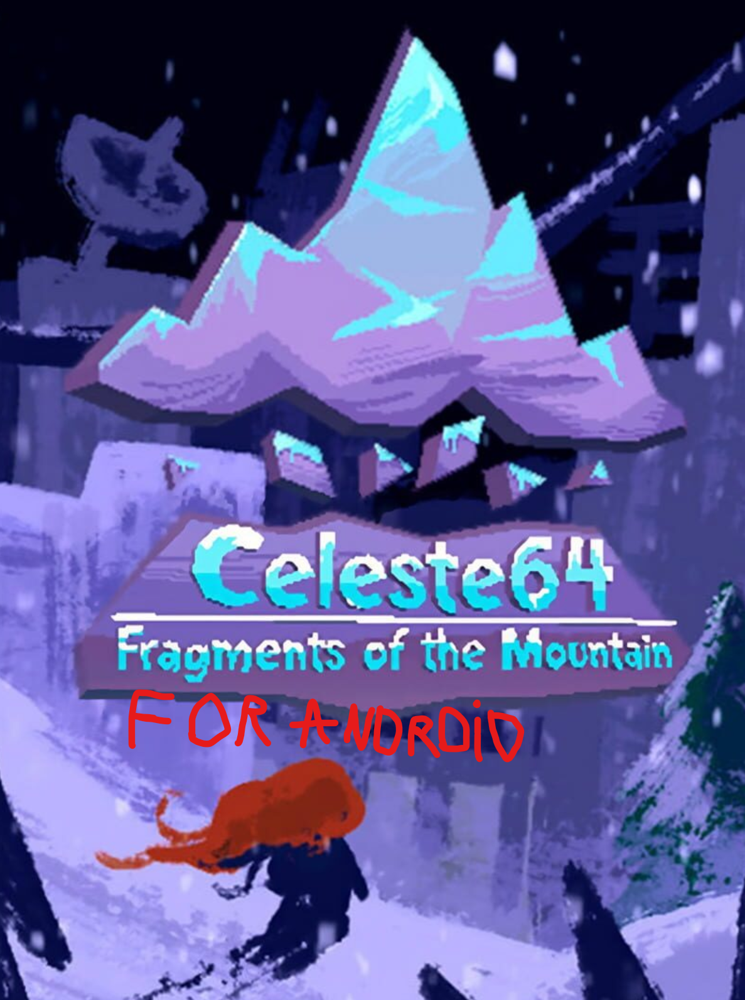

# Celeste64 Android Port



This fork ports *Celeste 64: Fragments of the Mountain* to Android. The current goal is a playable APK first: gamepad controls, fullscreen rendering, and FMOD audio are working.

The original game was made by the Celeste developers in under 2 weeks for Celeste's 6th Anniversary. You can find the official prebuilt desktop version on [itch.io](https://maddymakesgamesinc.itch.io/celeste64).

## Android Status

- Boots and runs as a native Android APK through .NET 8 for Android and a native Foster/SDL platform library.
- Targets `android-arm64` / `arm64-v8a`.
- Uses the existing gamepad input path; Xbox controller input has been tested.
- FMOD audio works with the Android FMOD 2.02.18 runtime.
- The game renders fullscreen on wide Android displays, including display cutout areas.
- Touch controls are not implemented yet.

## Android Build Requirements

- [.NET 8 SDK](https://dotnet.microsoft.com/en-us/download/dotnet/8.0)
- Android SDK and NDK installed through the Android SDK manager
- `ANDROID_HOME` and `ANDROID_SDK_ROOT` pointing at your Android SDK
- FMOD Studio API 2.02.18 for Android if you need to refresh the Android FMOD runtime files

This repository includes the Android FMOD runtime files needed by the APK, but not the full downloaded FMOD SDK archive. The archive is intentionally ignored by git.

## Build The APK

From the repository root:

```powershell
$env:ANDROID_HOME = 'D:\androidsdk'
$env:ANDROID_SDK_ROOT = 'D:\androidsdk'
dotnet publish Celeste64.Android\Celeste64.Android.csproj -c Release -r android-arm64
```

The signed APK is written to:

```text
Celeste64.Android\bin\Release\net8.0-android\android-arm64\publish\com.celeste64.android-Signed.apk
```

## Install On A Device

With USB debugging or wireless debugging enabled:

```powershell
D:\androidsdk\platform-tools\adb.exe connect <device-ip>:<port>
D:\androidsdk\platform-tools\adb.exe install -r Celeste64.Android\bin\Release\net8.0-android\android-arm64\publish\com.celeste64.android-Signed.apk
```

For a local USB device, skip the `adb connect` line.

## Refresh FMOD Android Runtime Files

If the Android FMOD files need to be replaced, download `fmodstudioapi20218android.tar.gz` from FMOD, then copy:

```text
api/core/lib/arm64-v8a/libfmod.so       -> Celeste64.Android/Native/arm64-v8a/libfmod.so
api/studio/lib/arm64-v8a/libfmodstudio.so -> Celeste64.Android/Native/arm64-v8a/libfmodstudio.so
api/core/lib/fmod.jar                   -> Celeste64.Android/Java/Libs/fmod.jar
```

Do not commit the full FMOD SDK archive.

## Desktop Build

The original desktop project is still present.

```powershell
dotnet restore
dotnet run --project Celeste64.csproj
```

## Libraries Used

- [Foster](https://github.com/FosterFramework/Foster) + [SDL2](https://github.com/libsdl-org/sdl): Input, windowing, and rendering.
- [SledgeFormats](https://github.com/LogicAndTrick/sledge-formats): Parsing TrenchBroom level formats.
- [SharpGLTF](https://github.com/vpenades/SharpGLTF): Parsing and animating glTF2 models.
- [FMOD](https://www.fmod.com): Music and sound effects.

## Tools Used

- [TrenchBroom](https://trenchbroom.github.io/): Level editing.
- [Blender](https://www.blender.org/): 3D models.
- [Aseprite](https://www.aseprite.org/): Textures.

## Resources Used

- [Khronos glTF Tutorials](https://github.khronos.org/glTF-Tutorials/gltfTutorial/gltfTutorial_020_Skins.html#the-joint-matrices): Mesh skin and bone references.
- [LearnOpenGL](https://learnopengl.com/Advanced-OpenGL/Depth-testing): Rendering concepts and depth normalization.
- [Kenney's Input Prompts](https://kenney.nl/assets/input-prompts): UI button prompts.
- [Renogare](https://www.dafont.com/renogare.font): Main font.

## Created By

- [Maddy Thorson](http://maddymakesgames.com/)
- [Noel Berry](https://noelberry.ca)
- [Amora B.](https://amorabettany.com)
- [Pedro "Saint11" Medeiros](http://saint11.org/)
- [Power Up Audio](https://powerupaudio.com/)
- [Lena Raine](https://lena.fyi/)
- [Heidy Motta](https://www.heidy.page/)

## License

- The Celeste IP and everything in the `Content` folder are owned by [Maddy Makes Games, Inc](https://www.maddymakesgames.com/).
- The `Source` folder, with exceptions where noted, is [licensed under MIT](Source/License.txt).
- The `Source/Audio/FMOD` folder contains bindings and binaries from FMOD.
- The Android FMOD runtime files are governed by the FMOD license and require in-game attribution to "FMOD Studio" and "Firelight Technologies Pty Ltd".
- Non-commercial mods, levels, and fan games may use assets from the `Content` folder as long as it is clear they are not made by the Celeste team or endorsed by them.
